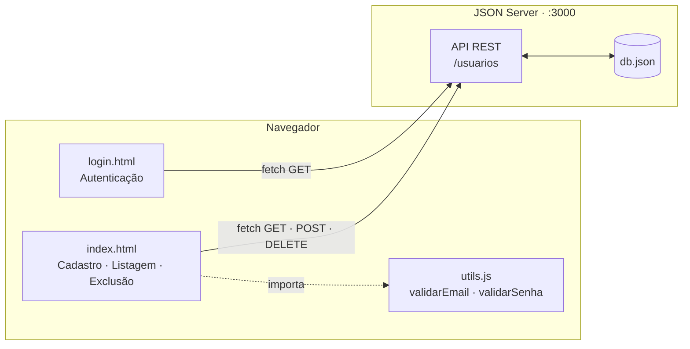
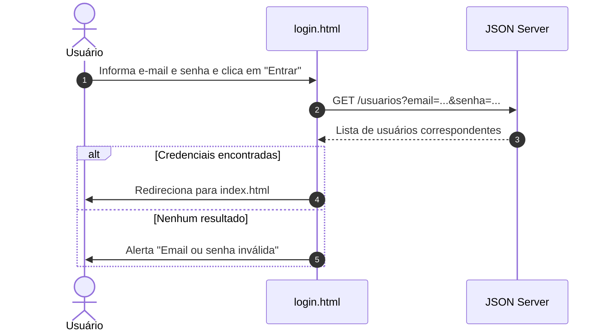

# Front JSON Server

**Interface web de cadastro e autenticação de usuários sobre uma API REST simulada** — protótipo de frontend em HTML, CSS e JavaScript puro que consome o [JSON Server](https://github.com/typicode/json-server), com login, cadastro validado no cliente, listagem e exclusão de usuários.

`HTML5` · `CSS3` · `JavaScript (ES6+)` · `Fetch API` · `JSON Server`

---

## Sumário

1. [Visão geral](#1-visão-geral)
2. [Arquitetura](#2-arquitetura)
3. [Stack tecnológica](#3-stack-tecnológica)
4. [Estrutura do projeto](#4-estrutura-do-projeto)
5. [Funcionalidades](#5-funcionalidades)
6. [Regras de validação](#6-regras-de-validação)
7. [Referência da API simulada](#7-referência-da-api-simulada)
8. [Modelo de dados](#8-modelo-de-dados)
9. [Instalação e execução local](#9-instalação-e-execução-local)
10. [Convenções de código](#10-convenções-de-código)

---

## 1. Visão geral

O projeto demonstra o ciclo completo de consumo de uma API REST por um frontend **sem frameworks e sem etapa de build**: uma página de login, uma página de gerenciamento de usuários e uma biblioteca de validações reutilizável. O backend é substituído pelo **JSON Server**, que expõe o arquivo `db.json` como uma API REST completa em poucos segundos, permitindo desenvolver e validar a interface de forma independente de um servidor real.

| Aspecto | Descrição |
|---|---|
| **Objetivo** | Prototipar autenticação e CRUD de usuários contra uma API simulada |
| **Abordagem** | Frontend estático (vanilla JS) + API mock com persistência em arquivo JSON |
| **Dependências de runtime** | Nenhuma — apenas o JSON Server como serviço de apoio |
| **Público-alvo** | Estudo, prototipação e validação de contratos de API |

---

## 2. Arquitetura



**Fluxo de autenticação**



---

## 3. Stack tecnológica

| Categoria | Tecnologia | Finalidade |
|---|---|---|
| Marcação | HTML5 | Estrutura das páginas |
| Estilo | CSS3 (Flexbox) | Layout e estilização, embutidos em cada página |
| Lógica | JavaScript ES6+ (`async/await`) | Interação, validações e chamadas HTTP |
| Comunicação | Fetch API | Consumo da API REST |
| API simulada | [JSON Server](https://github.com/typicode/json-server) | API REST completa a partir de `db.json` |

---

## 4. Estrutura do projeto

```
front-json-server/
├── index.html      # Gerenciamento de usuários: cadastro, listagem e exclusão
├── login.html      # Tela de autenticação
├── utils.js        # Biblioteca de validações (e-mail e senha)
├── db.json         # Base de dados do JSON Server (coleção "usuarios")
└── README.md
```

| Arquivo | Responsabilidade |
|---|---|
| `login.html` | Formulário de login e validação de credenciais junto à API |
| `index.html` | Formulário de cadastro com feedback de validação, tabela de usuários e ação de exclusão |
| `utils.js` | Funções `validarEmail()` e `validarSenha()`, retornando mensagens de erro específicas |
| `db.json` | Fonte de dados persistente da API simulada |

---

## 5. Funcionalidades

### 5.1 Login (`login.html`)

- Formulário com campos de **e-mail** e **senha** (campo mascarado).
- Consulta a API filtrando por `email` e `senha`; havendo correspondência, redireciona para `index.html`.
- Em caso de credenciais inválidas, exibe alerta ao usuário.

### 5.2 Cadastro de usuários (`index.html`)

- Formulário com **nome**, **e-mail** e **senha**.
- Validação em tempo de envio com **mensagens específicas** para cada regra violada, exibidas ao lado do campo (vermelho para erro, verde para sucesso — "Email válido!" e "Senha forte!").
- O e-mail é normalizado para **minúsculas** antes de ser enviado.
- Após o cadastro, a página é recarregada e a listagem, atualizada.

### 5.3 Listagem de usuários

- Ao carregar a página (`onload`), busca todos os usuários e renderiza uma tabela com **Id**, **Nome**, **E-mail** e **Ações**.

### 5.4 Exclusão de usuários

- Botão **Deletar** em cada linha remove o registro via `DELETE` e atualiza a tabela imediatamente.

---

## 6. Regras de validação

Implementadas em `utils.js`, cada função retorna `null` quando o valor é válido ou uma **mensagem descritiva** quando há erro.

### `validarEmail(email)`

| # | Regra | Mensagem |
|:---:|---|---|
| 1 | Não pode ser vazio | "O e-mail não pode estar vazio." |
| 2 | Não pode conter espaços | "O e-mail não pode conter espaços em branco." |
| 3 | Deve conter exatamente um `@` | "O e-mail deve conter exatamente um '@'." |
| 4 | Deve haver nome de usuário antes do `@` | "Insira o nome de usuário antes do '@'." |
| 5 | Deve haver domínio após o `@` | "Insira o domínio após o '@' (ex: gmail.com)." |
| 6 | O domínio deve conter um ponto | "O domínio do e-mail deve conter um ponto (ex: .com)." |
| 7 | O ponto não pode iniciar nem terminar o domínio | "O ponto não pode estar no início ou no fim do domínio." |

### `validarSenha(senha)`

| # | Regra | Mensagem |
|:---:|---|---|
| 1 | Não pode ser vazia | "A senha não pode estar vazia." |
| 2 | Mínimo de **8 caracteres** | "A senha deve ter pelo menos 8 caracteres." |
| 3 | Ao menos uma letra **maiúscula** | "A senha deve conter pelo menos uma letra maiúscula." |
| 4 | Ao menos uma letra **minúscula** | "A senha deve conter pelo menos uma letra minúscula." |
| 5 | Ao menos um **número** | "A senha deve conter pelo menos um número." |
| 6 | Ao menos um **caractere especial**: `! @ # $ % * , . ? /` | "A senha deve conter um caractere especial (!@#$%*,.?/)." |

---

## 7. Referência da API simulada

**Base URL (local):** `http://localhost:3000`

O JSON Server gera automaticamente as rotas REST para a coleção `usuarios`. Os endpoints utilizados pela interface:

| Método | Endpoint | Utilizado em | Descrição |
|---|---|---|---|
| `GET` | `/usuarios` | `index.html` | Lista todos os usuários |
| `GET` | `/usuarios?email={email}&senha={senha}` | `login.html` | Filtra usuários por credenciais (autenticação) |
| `POST` | `/usuarios` | `index.html` | Cadastra um novo usuário |
| `DELETE` | `/usuarios/{id}` | `index.html` | Remove um usuário pelo identificador |

**Exemplo — cadastro**

```bash
curl -X POST http://localhost:3000/usuarios \
  -H "Content-Type: application/json" \
  -d '{
        "nome": "Maria Silva",
        "email": "maria@exemplo.com",
        "senha": "Senha@123"
      }'
```

**Resposta**

```json
{
  "nome": "Maria Silva",
  "email": "maria@exemplo.com",
  "senha": "Senha@123",
  "id": "8"
}
```

O JSON Server também oferece, sem configuração adicional, recursos como paginação (`?_page=1&_limit=10`), ordenação (`?_sort=nome`) e busca por campo, úteis para evoluir a interface.

---

## 8. Modelo de dados

Arquivo `db.json`, coleção `usuarios`:

| Campo | Tipo | Descrição |
|---|---|---|
| `id` | `number \| string` | Identificador único, gerado automaticamente pelo JSON Server |
| `nome` | `string` | Nome do usuário |
| `email` | `string` | E-mail do usuário (armazenado em minúsculas) |
| `senha` | `string` | Senha do usuário |

```json
{
  "usuarios": [
    {
      "id": 1,
      "nome": "Nome do Usuário",
      "email": "usuario@exemplo.com",
      "senha": "********"
    }
  ]
}
```

---

## 9. Instalação e execução local

### Pré-requisitos

- **Node.js** 18+ (para executar o JSON Server via `npx`)
- Navegador moderno

### Passo a passo

```bash
# 1. Clonar o repositório
git clone https://github.com/Core-System/front-json-server.git
cd front-json-server

# 2. Iniciar a API simulada na porta 3000
npx json-server db.json --port 3000
#    (JSON Server 0.17.x: npx json-server --watch db.json --port 3000)

# 3. Servir as páginas estáticas em outro terminal
npx serve .
```

Em seguida, acesse a URL exibida pelo `serve` e abra `login.html` (ou `index.html`).

> 💡 Alternativa: abrir a pasta no VS Code e usar a extensão **Live Server** para servir as páginas.

### Endereços

| Serviço | URL |
|---|---|
| API simulada (JSON Server) | `http://localhost:3000` |
| Coleção de usuários | `http://localhost:3000/usuarios` |
| Frontend | URL informada pelo servidor estático escolhido |

---

## 10. Convenções de código

- **Idioma do domínio:** funções, variáveis, mensagens de interface e de validação em **português (pt-BR)**.
- **Sem etapa de build:** arquivos estáticos carregados diretamente pelo navegador, o que simplifica o ciclo de desenvolvimento.
- **Validações isoladas e reutilizáveis:** regras concentradas em `utils.js`, retornando `null` ou uma mensagem, o que facilita reuso, testes e exibição de feedback contextual.
- **Assincronismo moderno:** chamadas HTTP com `async/await` sobre a Fetch API.
- **Feedback imediato ao usuário:** mensagens de erro e sucesso exibidas junto aos campos, com cores semânticas.
- **Contrato REST padrão:** uso dos verbos `GET`, `POST` e `DELETE` sobre o recurso `/usuarios`.
